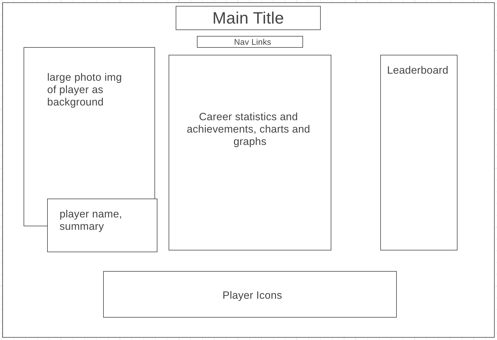

# goat_debate_project

https://wesleycheungg.github.io/NBA_GOAT_project/

## Background and Overview
The Goat Debate project is a data visualization webpage that allows the user to select an NBA player and compare their career resumes between the other players and decide who is the GOAT (Greatest of All Time) in the NBA. The user will have the option of toggling between 10 different NBA players. Once a player is clicked or toggled on, the webpage will display career statistics, achievements, top 10 plays, and a photo gallery. It is interactive in that it allows the user to have the ability toggle from one player to another smoothly, play the video, and cycle through different photos. The user can easily compare career resumes and they will also have the ability to upvote a player that they beleive is the GOAT.

## Functionality & MVPs
In the Goat Debate project, users will be able to:
* Toggle through the different players -> will then populate player profile
* Click on icon, icon will be colored with a yellow border to show player selected
* Click on a button to upvote a player as their "GOAT". 
* Interactive image gallery that allows you to click through

In addition, this project will include:
* A production README
* 10(# could change...) different players that they can select as their GOAT.
* Quick summary of each player and their career.

## Wireframe
* wireframe link: https://wireframe.cc/WwwHSV

* Nav links: GitHub Repo, LinkedIn
* Player icons : icons of 10 nba players that when clicked will change the image, player, and data.

## Technologies, Libraries, APIs
This project will be inplemented with the following technologies:
* CanvasJS for data-visualization
* Webpack

## Implementation Timeline
* Friday Afternoon & Weekend: Setup project, include getting the skeleton ready, getting webpack up and running. Get the webpage to display and show something on the screen. Create the Player and PlayerIcon classes.
* Monday: Dedicate this day toward populating specific player classes. (i.e. Stephen Curry, img, stats). Get started with CanvasJS to display data with graphs.
* Tuesday: Continue working on the previous days work and then begin with Leaderboard section. Implenent ability to upvote user as GOAT.
* Wednesday: Finsih implementing user controls and focus on styling as well as implementing color schemes of the prohect.
* Thursday Morning: Deploy to GitHub pages. If time, rewrite this proposal as a production README.

